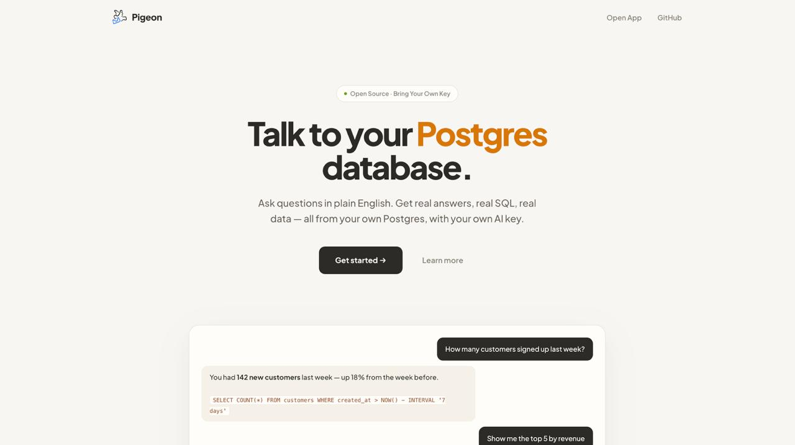

# 🐦 Pigeon


**Talk to your Postgres database in plain English. Open source. Bring your own AI key.**

Pigeon is a free, self-hostable alternative to paid "chat with your database" tools. Ask questions in natural language — get real SQL, real data, and real answers. Powered by whatever LLM you want to plug in.


**Try it live:** [pigeon-unht.onrender.com](https://pigeon-unht.onrender.com)
## Why Pigeon?

Most "chat with your database" tools charge $20–$200/month and lock you into their LLM. Pigeon is different:

- **Free forever.** No subscription. No credit card. MIT licensed.
- **Bring your own key.** Use OpenAI, OpenRouter, Groq, DeepSeek, Together, or a local Ollama model.
- **Bring your own database.** Connect to any Postgres — local, remote, or cloud.
- **Read-only by default.** The AI can only run `SELECT` queries. Guardrails at every layer.
- **You see the SQL.** Every answer shows the exact query that was executed.

## Features

-  Natural language questions → real SQL
-  Read-only guardrails (blocks `INSERT`, `UPDATE`, `DELETE`, `DROP`, etc.)
-  Multi-provider: OpenAI, OpenRouter, Groq, DeepSeek, Together AI, Ollama
-  Multi-conversation sidebar (like ChatGPT)
-  Results rendered as tables in the chat
-  5-second query timeout, `LIMIT 100` safety cap
-  Warm, minimal UI — not another dark-mode dashboard
-  Zero-cost AI usage — you pay your provider directly

## Quick start

### 1. Clone and install

```bash
git clone https://github.com/Harilol/pigeon.git
cd pigeon
python -m venv .venv
source .venv/bin/activate    # On Windows: .venv\Scripts\activate
pip install -r requirements.txt
```

### 2. Configure

```bash
cp .env.example .env
```

The `.env` file is optional. Pigeon works fully in "bring your own key" mode — users enter their AI credentials in the UI. If you want a fallback key for demos, add it:

```
GEMINI_API_KEY=your_key_here
```

### 3. Run

```bash
python manage.py migrate
python manage.py runserver
```

Open [http://127.0.0.1:8000](http://127.0.0.1:8000).

### 4. Use

1. Click **Get started**.
2. Enter your Postgres credentials. Click **Connect Database**.
3. In **AI Settings**, pick a provider (or paste any OpenAI-compatible base URL), paste your API key, and enter a model name that supports **tool calling**.
4. Ask questions in the chat.

## ⚠️ Model selection matters

**Free and small models are unreliable at tool calling.** You may see raw XML like `<tool_call>` in the chat instead of a proper answer. This isn't a bug in Pigeon — it's a limitation of the model itself. Some models work; some don't.

**For the best experience, use one of these models:**

| Provider | Model | Why |
|---|---|---|
| **OpenAI** | `gpt-4o-mini` | Cheap, fast, rock-solid tool calling |
| **OpenAI** | `gpt-4o` | Smarter, more expensive |
| **DeepSeek** | `deepseek-chat` | Very cheap, supports tools well |
| **OpenRouter** | `openai/gpt-4o-mini` | Same as OpenAI, unified billing |
| **OpenRouter** | `anthropic/claude-3.5-sonnet` | Best quality, more expensive |
| **Groq** | `llama-3.3-70b-versatile` | Free tier, works most of the time |
| **Ollama** | `llama3.3` (local) | Free forever, requires GPU/RAM |

**Avoid:** Models labeled "mini-free", "flash-lite", "reasoner", or anything with "preview" in the name. These usually don't support structured tool calling properly.

**How to check if a model supports tools:**
- [OpenRouter — tool-capable models](https://openrouter.ai/models?supported_parameters=tools)
- [OpenAI — function calling docs](https://platform.openai.com/docs/guides/function-calling)

## How it works

```
Browser ──> Django ──> AI provider (with tool: run_sql)
                 │
                 └──> Postgres (SELECT only)
```

1. User asks a question in the chat.
2. Django fetches the database schema.
3. The schema and question are sent to the AI with a `run_sql` tool.
4. The AI decides whether to call the tool.
5. If it calls, `run_sql` validates the query (SELECT only, no banned words, no multi-statements) and runs it with a 5-second timeout and `LIMIT 100`.
6. The result is fed back to the AI, which writes a natural language answer.

## Guardrails

Read-only enforcement happens at **four** layers:

1. **Prompt rules** — the AI is told to only output SELECT.
2. **Python validation** — the SQL string is checked before execution:
   - Must start with `SELECT`
   - Cannot contain `INSERT`, `UPDATE`, `DELETE`, `DROP`, `ALTER`, `TRUNCATE`, `CREATE`, `GRANT`, `REVOKE`, `MERGE`, `REPLACE`
   - Cannot contain multiple statements (`;` in the middle)
3. **Wrapping** — the query is wrapped in `SELECT * FROM (...) LIMIT 100`.
4. **Postgres timeout** — queries over 5 seconds are killed.

For maximum safety, connect with a **read-only Postgres user**. Pigeon works with any credentials, but the safest setup is a dedicated read-only role.

## Tech stack

- **Django** — backend
- **psycopg2** — Postgres driver
- **OpenAI SDK** — universal LLM client (works with any OpenAI-compatible provider)
- **Vanilla JS** — no build step, no framework
- **localStorage** — conversations and credentials stay in the browser

## Project structure

```
pigeon/
├── config/           # Django project settings
├── core/
│   ├── templates/
│   │   ├── landing.html
│   │   └── connect.html
│   ├── views.py      # connect_page, landing_page, ask_ai
│   └── urls.py
├── docs/
│   └── screenshot.png
├── manage.py
├── requirements.txt
└── README.md
```

## Roadmap

- [ ] CSV export on result tables
- [ ] Mobile responsive layout
- [ ] Query explanation mode (AI explains the SQL)
- [ ] Schema browser sidebar
- [ ] Support for MySQL / SQLite
- [ ] Docker one-command setup

## Contributing

Pull requests welcome. For major changes, open an issue first.

## Author

Built by [@Harilol](https://github.com/Harilol).

If you find Pigeon useful, ⭐ the repo and share it.

## License

MIT — see [LICENSE](LICENSE).
